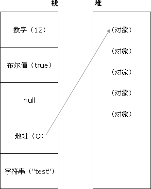

## <a name='list'>目录</a>

  1. [HTML部分](#html)
  1. [CSS部分](#css)
  1. [JavaScript部分](#js)


## <a name="html">HTML</a>
- Doctype 的作用？严格模式与混杂模式如何区分？它们有何意义？

```
1. <!DOCTYPE> 不是 HTML 标签，它位于 HTML 文档的第一行，用来告知浏览器的解析器用什么文档标准来解析这个文档，DOCTYPE 缺少或错误会导致文档以兼容模式显示。注意：DOCTYPE 没有结束标签，声明对大小写不敏感。
2. 标准模式的排版和 JS 模式是按照当前浏览器支持的最高标准运行的，在兼容模式中，页面会以宽松的向后兼容的方式显示，模拟老式浏览器的行为以防站点无法正常工作。
```

- HTML5 为什么只需要写 <!DOCTYPE>

```
HTML5 不基于 SGML，因此不需要对 DTD 进行引用，但是需要声明 doctype 来规范浏览器的行为。
```

- 行内元素有哪些？块级元素有哪些？空（void）元素有哪些？

```
行内元素：a b span img input select strong
块级元素：div p ul ol li dl dt dd h1 h2 h3 h4…
常见空元素：<br> <hr>  <input> <link> <meta>
鲜为人知的是：<area> <base> <col> <command> <embed> <keygen> <param> <source> <track> <wbr>
```

- 页面导入样式时，使用 link 和 @import 有什么区别？

```
1. link 除了可以加载 CSS 外，还可以用来定义指向 RSS 的超连接，而@import是CSS提供的，只能用于加载CSS;
2. 页面被加载的时候，link 会同时被加载，而 @import 引用的 CSS 会等到页面被加载完再加载;
3. import 只在IE5以上才能被识别，而 link 是 XHTML 标签，无兼容问题。
```

- 说说你对浏览器内核的理解

```
浏览器内核包括渲染引擎和 JS 引擎。
渲染引擎负责取得网页的内容（HTML,图像等），以及 整理讯息（加入 CSS ），以及计算网页的显示方式，然后输出到显示器或者打印机。浏览器的内核不同对网页的语法解释有所不同，所以渲染的效果也不一样。
JS 引擎解析和执行 JavaScript 来实现网页的动态效果。
```

- 常见的浏览器内核有哪些？

```
Webkit：chrome，Safari 等,(chrome:Blink,Webkit 的分支)；
Trident：IE,360,搜狗浏览器等；
Gecko：Firefox等；
Presto内核：Opera7及以上。(Opera 内核原为：Presto，现为：Blink;)
```

- HTML5 有哪些新特性、移除了那些元素？如何处理 HTML5 新标签的浏览器兼容问题？如何区分 HTML 和 HTML5？

```
HTML5 新特性：
1.HTML5 现在已经不是 SGML 的子集，主要是关于图像，位置，存储，多任务等功能的增加。
2. 用于绘画的 canvas 元素
3. 用于媒介回放的 video 和 audio 元素
4. 对本地离线存储的更好的支持
5. 新的特殊内容元素，比如 article、footer、header、nav、section
6. 新的表单控件，比如 calendar、date、time、email、url、search

移除的元素：
纯表现的元素：basefont，big，center，font, s，strike，tt，u;
对可用性产生负面影响的元素：frame，frameset，noframes；

支持HTML5新标签：
IE8/IE7/IE6支持通过 document.createElement 方法产生的标签，可以利用这一特性让这些浏览器支持 HTML5 新标签，浏览器支持新标签后，还需要添加标签默认的样式（当然最好的方式是直接使用成熟的框架、使用最多的是 html5shiv 框架）：
<!--[if lt IE 9]>
<script> src="http://html5shiv.googlecode.com/svn/trunk/html5.js"</script>
<![endif]-->

如何区分 HTML5： DOCTYPE 声明\新增的结构元素\功能元素
```

- 简述一下你对HTML语义化的理解？

```
语义化的含义就是用正确的标签做正确的事情，
html 语义化就是让页面的内容结构化，便于对浏览器、搜索引擎解析；
在没有样式 CCS 情况下也以一种文档格式显示，并且是容易阅读的。
搜索引擎的爬虫依赖于标记来确定上下文和各个关键字的权重，利于 SEO。
使阅读源代码的人对网站更容易将网站分块，便于阅读维护理解。
```

- HTML5 的离线储存怎么使用，工作原理能不能解释一下？

```
HTML5 引入了应用程序缓存，这意味着 web 应用可进行缓存，并可在没有因特网连接时进行访问。

原理：HTML5的离线存储是基于一个新建的.appcache 文件的缓存机制(不是存储技术)，通过这个文件上的解析清单离线存储资源，这些资源就会像 cookie 一样被存储了下来。之后当网络在处于离线状态下时，浏览器会通过被离线存储的数据进行页面展示。


应用程序缓存为应用带来三个优势：
离线浏览 - 用户可在应用离线时使用它们
速度 - 已缓存资源加载得更快
减少服务器负载 - 浏览器将只从服务器下载更新过或更改过的资源。

如何使用：
1、页面头部像下面一样加入一个manifest的属性；
2、在cache.manifest文件的编写离线存储的资源；
    CACHE MANIFEST
    #v0.11
    CACHE:
    js/app.js
    css/style.css
    NETWORK:
    resourse/logo.png
    FALLBACK:
    / /offline.html
3、在离线状态时，操作window.applicationCache进行需求实现。
```
参考阅读：[HTML5 应用程序缓存](http://w3school.com.cn/html5/html_5_app_cache.asp)

- 浏览器是怎么对HTML5的离线储存资源进行管理和加载的呢？

```
1. 在线的情况下，浏览器发现html头部有manifest属性，它会请求manifest文件，如果是第一次访问app，那么浏览器就会根据manifest文件的内容下载相应的资源并且进行离线存储。如果已经访问过app并且资源已经离线存储了，那么浏览器就会使用离线的资源加载页面，然后浏览器会对比新的manifest文件与旧的manifest文件，如果文件没有发生改变，就不做任何操作，如果文件改变了，那么就会重新下载文件中的资源并进行离线存储。
2. 离线的情况下，浏览器就直接使用离线存储的资源。
```

- 请描述一下 cookies，sessionStorage 和 localStorage 的区别？

```
cookie:网站为了标示用户身份而储存在用户本地终端（Client Side）上的数据（通常经过加密）。cookie 数据始终在同源的 http 请求中携带（即使不需要），记会在浏览器和服务器间来回传递。
sessionStorage 和 localStorage 不会自动把数据发给服务器，仅在本地保存。

存储：
cookie 数据大小不能超过 4k。
sessionStorage 和 localStorage 虽然也有存储大小的限制，但是比 cookie 大得多。

有效期时间：
localStorage - 没有时间限制的数据存储
sessionStorage - 针对一个 session 的数据存储
cookie - 在设置的 cookie 过期时间之前一直有效，即使窗口或浏览器关闭

localStorage 使用方法：
<script type="text/javascript">
localStorage.lastname="Smith";
document.write(localStorage.lastname);
</script>

sessionStorage 使用方法：
<script type="text/javascript">
sessionStorage.lastname="Smith";
document.write(sessionStorage.lastname);
</script>
```

- iframe有那些缺点？

```
1. iframe 会阻塞主页面的 Onload 事件；
2. 搜索引擎的检索程序无法解读这种页面，不利于 SEO;
3. iframe 和主页面共享连接池，而浏览器对相同域的连接有限制，所以会影响页面的并行加载。
4. 如果需要使用 iframe，最好是通过 javascript 动态给 iframe 添加 src 属性值，这样可以绕开以上两个问题。
```

- Label的作用是什么？是怎么用的？（加 for 或 包裹）

```
label 标签来定义表单控制间的关系,当用户选择该标签时，浏览器会自动将焦点转到和标签相关的表单控件上。
```

-  HTML5 的 form 如何关闭自动完成功能？
```
autocomplete=off
```

## <a name="css">CSS</a>
- 标准的 CSS 盒子模型？与低版本的盒子模型有什么不同？

```
1. 盒模型有两种：IE 盒子模型，W3C 盒子模型（标准盒子模型）。
2. CSS 盒模型包括：margin（外边距），border（边框），padding（内边距），内容(content)。
3. IE5.X 和 6 在怪异模式中使用自己的非标准模型。这些浏览器的 width  属性不是内容的宽度，而是内容、内边距和边框的宽度的总和
```

- CSS 选择符有哪些？哪些属性可以继承？

```
1. 元素选择器（div, h1, p）
2. id 选择器（#id）
3. 类选择器（.class）
4. 属性选择器（*[name="title"]）(子串匹配属性选择器:[abc^="def"])
5. 相邻兄弟选择器（h1 + p）
6. 子选择器（ul > li）
7. 后代选择器（li a）
8. 伪类选择器（a:hover, li:nth-child）
9. 通配符选择器（ * ）

可以继承的样式： font-family font-size color, UL LI DL DD DT;
不可继承的样式： margin border padding  width height;
```

- CSS3 新增的伪类有哪些？

```
新的伪类：
:target， :enabled 和 :disabled，
:checked， :indeterminate， :root，
:nth-child 和 :nth-last-child，
:nth-of-type 和 :nth-last-of-type，
:first-of-type 和 :last-of-type，
:last-child :only-child 和 :only-of-type，
:empty， 和 :not。
```

- CSS 优先级算法

```
1. 优先级就是一个 应用于指定的 CSS 声明的权重，它由 匹配的选择器中的每一种选择器类型的 数值 决定。而当优先级与多个 CSS 声明中任意一个声明的优先级相等的时候，CSS 中最后的那个声明将会被应用到元素上。当同一个元素有多个声明的时候，优先级才会有意义。因为每一个直接作用于元素的 CSS 规则总是会接管/覆盖（take over）该元素从祖先元素继承而来的规则。
2. 优先级就近原则，同权重情况下样式定义最近者为准;载入样式以最后载入的定位为准;
   优先级为: !important >  id > class > tag
3. 注意：当在一个样式声明上使用 !important 规则时，该样式声明会覆盖 CSS 中任何其他的声明,。尽管技术上 !important 与优先级毫无关系，但是它们之间直接相互影响。
   使用 !important 是一个坏习惯，应该尽量避免，因为这打断了样式表中的固有的级联规则，使得调试找 bug 变得更加困难了。当两条相互冲突的带有!important 规则的声明被应用到相同的元素上时，拥有更大优先级的声明将会被采用。
```
- 如何居中 div？如何居中一个浮动元素？如何让绝对定位的 div 居中？
    + 居中 div:给 div 设置一个宽度，然后设置 margin:0,auto

        ```
            div {
                width:200px;
                margin:0 auto;
                }
        ```

    + 居中浮动元素

        ```
        .div{
            width:500px;/*规定宽度为500px,高度可选*/
            height:300px;
            color:#fff;
            background:#000;
            margin-left:50%;/* 让元素左边界位于中间*/
            position:relative;/* 设置相对定位*/
            left:-250px;/* 设置-left/2  也就是500px/2使元素居中 */
                }
        ```

    + 绝对定位的 div 居中

        ```
            position: absolute;
            width: 1200px;
            background: none;
            margin: 0 auto;
            top: 0;
            left: 0;
            bottom: 0;
            right: 0;
        ```

扩展阅读：
    1. [六种实现元素水平居中的方法](http://www.w3cplus.com/css/elements-horizontally-center-with-css.html)
    2. [Flex 布局教程：语法篇](www.ruanyifeng.com/blog/2015/07/flex-grammar.html)
    3. [flex - CSS | MDN](https://developer.mozilla.org/zh-CN/docs/Web/CSS/flex)

- display 有哪些值？说明他们的作用。

```
block:此元素将显示为块级元素，此元素前后会带有换行符。
inline: 默认。此元素会被显示为内联元素，元素前后没有换行符。
inline-block:象行内元素一样显示，但其内容象块类型元素一样显示。
none:此元素不会被显示。
list-item:此元素会作为列表显示。
table:此元素会作为块级表格来显示。
flex:弹性布局（Flexible Box）
```

- position 的值 relative 和 absolute 定位原点是？

```
absolute：生成绝对定位的元素，相对于值不为 static的第一个父元素进行定位。
fixed （老IE不支持）：生成绝对定位的元素，相对于浏览器窗口进行定位。
relative：生成相对定位的元素，相对于其正常位置进行定位。
inherit：规定从父元素继承 position 属性的值。
```

- CSS3 有哪些新特性？

```
1. 新增各种CSS选择器
2. 圆角:border-radius
3. 多列布局：multi-column layout
4. 阴影和反射：Shadow\Reflect
5. 文字特效、文字渲染
6. 线性渐变：gradient
7. 旋转：transform
8. 增加了旋转,缩放,定位,倾斜,动画，多背景
```
参考阅读：
1. [CSS3 | MDN](https://developer.mozilla.org/zh-CN/docs/Web/CSS/CSS3)
2. [使用CSS的多列布局](https://developer.mozilla.org/zh-CN/docs/Web/Guide/CSS/Using_multi-column_layouts)
3. [CSS3 参考手册 box-reflect](http://www.css88.com/book/css/properties/only-webkit/box-reflect.htm)

- 请解释一下CSS3的Flexbox（弹性盒布局模型）,以及适用场景？

```
flexbox 布局模式被用来重新定义 CSS 中的布局方式。
CSS3 弹性框(Flexible Box 或 Flexbox)，是一种当页面需要适应不同的屏幕大小以及设备类型时确保元素拥有恰当排布行为的布局方式。对很多应用程序来说，由于不使用浮动，且弹性容器的外边距也不会与其内容的外边距合并，弹性框模型比起方框模型要好一些。

应用场景：网格布局，圣杯布局，输入框的布局，固定的底栏
```
参考阅读：
1. [Flex 布局教程：语法篇](http://www.ruanyifeng.com/blog/2015/07/flex-grammar.html)
2. [Flex 布局教程：实例篇](http://www.ruanyifeng.com/blog/2015/07/flex-examples.html)
3. [使用 CSS 弹性框 | MDN](https://developer.mozilla.org/zh-CN/docs/Web/CSS/CSS_Flexible_Box_Layout/Using_CSS_flexible_boxes)
4. [A Complete Guide to Flexbox](https://css-tricks.com/snippets/css/a-guide-to-flexbox/)

- 用纯 CSS 创建一个三角形的原理是什么？

```
把其中三条边框隐藏掉，注：IE6下把边框设置成 transparent 时会出现黑影，并不会透明，把 border-style 设置成 dashed 可以解决。

.triangle{
    width:0;
    height:0;
    border-width:20px;
    border-style:solid dashed dashed dashed;
    border-color:#e66161 transparent transparent transparent;
}
```

- 一个满屏品字布局何设计?
```
 设置上面的 div 宽 100%，下面的两个 div 分别宽 50%，然后用 float 或者 inline 使其不换行即可
```

- li 与 li 之间有看不见的空白间隔是什么原因引起的？有什么解决办法？

```
行框的排列会受到中间空白（回车\空格）等的影响，因为空格也属于字符,这些空白也会被应用样式，占据空间，所以会有间隔，把字符大小设为 0，就没有空格了。
```

 
## <a name="js">JavaScript</a>
- JavaScript 的基本数据类型

```
1. 字符串（string）
2. 数字（Number）
3. 布尔值（Boolean）
4. Undefind
5. Null
```

- js有哪些内置对象？
```
Object 是 JavaScript 中所有对象的父对象。
数据封装类对象：Object、Array、Boolean、Number 和 String。
其他对象：Function、Arguments、Math、Date、RegExp、Error 。
```
- JavaScript 的基本规范

```
简单地列出一些：
1. 不要在同一行申明多个变量
2. 使用===/!==来比较 true/false
3. 使用对象字面量
4. For 循环必须使用大括号
5. If 语句必须使用大括号
6. for-in 循环中的变量 应该使用var关键字明确限定作用域，从而避免作用域污染。
7. 不要使用全局函数
8. 函数不应该有时候有返回值，有时候没有返回值。
9. Switch 语句必须带有 default 分支
```
可参考百度 FEX 的 [JavaScript 编码规范](https://github.com/fex-team/styleguide)

- JavaScript 原型，原型链 ? 有什么特点？

```
每个对象都有一个 prototype （原型） 属性，这个属性是一个指针，指向这个对象。这个对象的用途是包含可以由特定类型的所有实例共享的属性和方法。（详见《JavaScript 高级程序设计》第六章第二节）。
如果让原型对象等于另一个类型的实例，此时的原型对象将包含一个指向另一个原型的指针，相应地，另一个原型中也包含着一个指向另一个构造函数的指针，加入另一个原型又是另一个类型的实例，如此层层递进，就构成了原型链。

特点：
JavaScript 对象是通过引用来传递的，我们创建的每个新对象实体中并没有一份属于自己的原型副本。当我们修改原型时，与之相关的对象也会继承这一改变。
```
- JavaScript 有几种类型的值？（堆：原始数据类型和 栈：引用数据类型），你能画一下他们的内存图吗？
```
栈：原始数据类型（Undefined，Null，Boolean，Number、String）
堆：引用数据类型（对象、数组和函数）

在 ECMAScript 中，变量可以存在两种类型的值，即原始值和引用值。
原始值:存储在栈（stack）中的简单数据段，也就是说，它们的值直接存储在变量访问的位置。
引用值:存储在堆（heap）中的对象，也就是说，存储在变量处的值是一个指针（point），指向存储对象的内存处。
为变量赋值时，ECMAScript 的解释程序必须判断该值是原始类型，还是引用类型。要实现这一点，解释程序则需尝试判断该值是否为 ECMAScript 的原始类型之一，即 Undefined、Null、Boolean、Number 和 String 型。由于这些原始类型占据的空间是固定的，所以可将他们存储在较小的内存区域 - 栈中。这样存储便于迅速查寻变量的值。
如果一个值是引用类型的，那么它的存储空间将从堆中分配。由于引用值的大小会改变，所以不能把它放在栈中，否则会降低变量查寻的速度。相反，放在变量的栈空间中的值是该对象存储在堆中的地址。地址的大小是固定的，所以把它存储在栈中对变量性能无任何负面影响。
```


- JavaScript 如何实现继承？
```
1. 构造继承
2. 原型继承
3. 实例继承
4. 拷贝继承

原型prototype机制或apply和call方法去实现较简单，建议使用构造函数与原型混合方式。
```
参考阅读：[ECMAScript 继承机制实现](http://w3school.com.cn/js/pro_js_inheritance_implementing.asp)

- Javascript创建对象的几种方式？
    + 原始方式 `var object1=new Object`

    + 工厂方式

        ```
            function createObject() {
              var thisObject = new Object;
              thisObject.color = "blue";

              return thisObject;
            }

            var object1 = createObject();
        ```

    + 构造函数方式

        ```
            function Car(sColor,iDoors,iMpg) {
              this.color = sColor;
              this.doors = iDoors;
              this.mpg = iMpg;
              this.showColor = function() {
                alert(this.color);
              };
            }

            var oCar1 = new Car("red",4,23);
        ```

        在书写上构造函数跟其他函数是没有什么区别的，主要的区别还是在使用上，构造函数需要使用 new 操作符。
        这样的构造函数有一个缺陷，就是每个方法都会在每个实例上创建一次，因为每次创建都需要分配内存空间，但是有时候这样的特性还是有用的，主要是要控制它们，在不使用的时候释放内存。

    + 原型方式

        ```
            function Car() {
            }

            Car.prototype.color = "blue";
            Car.prototype.doors = 4;
            Car.prototype.mpg = 25;
            Car.prototype.showColor = function() {
                alert(this.color);
            };

            var oCar1 = new Car();
        ```

        原型的所有属性都被立即赋予要创建的对象，意味着所有 Car 实例存放的都是指向 showColor() 函数的指针。从语义上讲，所有属性看起来都属于一个对象，因此解决了前面两种方式存在的问题。但是如果需要保持原对象属性值是每一个对象特有的，而不是共享的，那就要联合使用构造函数和原型方式。
    + 混合的构造函数/原型方式

        ```
            var Computer = function(name){
                this.name = name;
            }
            Computer.prototype.showMessage = function(){
                alert(this.name);
            }
            var apple = new Computer('apple');
            apple.showMessage();
        ```

    + 动态原型方法

        ```
            function Car(sColor,iDoors,iMpg) {
              this.color = sColor;
              this.doors = iDoors;
              this.mpg = iMpg;
              this.drivers = new Array("Mike","John");

              if (typeof Car._initialized == "undefined") {
                Car.prototype.showColor = function() {
                  alert(this.color);
                };

                Car._initialized = true;
              }
            }
        ```

    + 混合工厂方式(这种方式通常是在不能应用前一种方式时的变通方法。它的目的是创建假构造函数，只返回另一种对象的新实例。)

        ```
        function Car() {
          var oTempCar = new Object;
          oTempCar.color = "blue";
          oTempCar.doors = 4;
          oTempCar.mpg = 25;
          oTempCar.showColor = function() {
            alert(this.color);
          };

          return oTempCar;
        }
        var car = new Car();

        注意：由于在 Car() 构造函数内部调用了 new 运算符，所以将忽略第二个 new 运算符（位于构造函数之外），在构造函数内部创建的对象被传递回变量 car。
        这种方式在对象方法的内部管理方面与经典方式有着相同的问题。强烈建议：除非万不得已，还是避免使用这种方式。
        ```

    + 寄生构造函数模式

        ```
            var test = function(name){
                return {'name':name}
            }
            var g = new test('apple');
        ```

参考阅读：[前端开发基础－JavaScript（二）-面向对象部分](http://mp.weixin.qq.com/s?__biz=MzI3MDE0MzAzMw==&mid=2652201871&idx=1&sn=c3b440a87c212015371f365c1d2b6e01&scene=4#wechat_redirect)

- Javascript作用链域?
- 
```
全局函数无法查看局部函数的内部细节，但局部函数可以查看其上层的函数细节，直至全局细节。
当需要从局部函数查找某一属性或方法时，如果当前作用域没有找到，就会上溯到上层作用域查找，直至全局函数，这种组织形式就是作用域链。
```

- 谈谈 This 对象的理解

```
this 总是指向函数的直接调用者（而非间接调用者）；
如果有 new 关键字，this 指向 new 出来的那个对象；
在事件中，this 指向触发这个事件的对象，特殊的是，IE 中的 attachEvent 中的 this 总是指向全局对象 Window；

```

详细可以阅读：[JavaScript 之 this 详解](http://gold.xitu.io/entry/576b81ae7db2a20054dad214)

- eval 是做什么的？

```
eval 可以把对应的字符串解析成JS代码并运行；
应该避免使用 eval，不安全，非常耗性能（2 次，一次解析成 js 语句，一次执行）。
```
